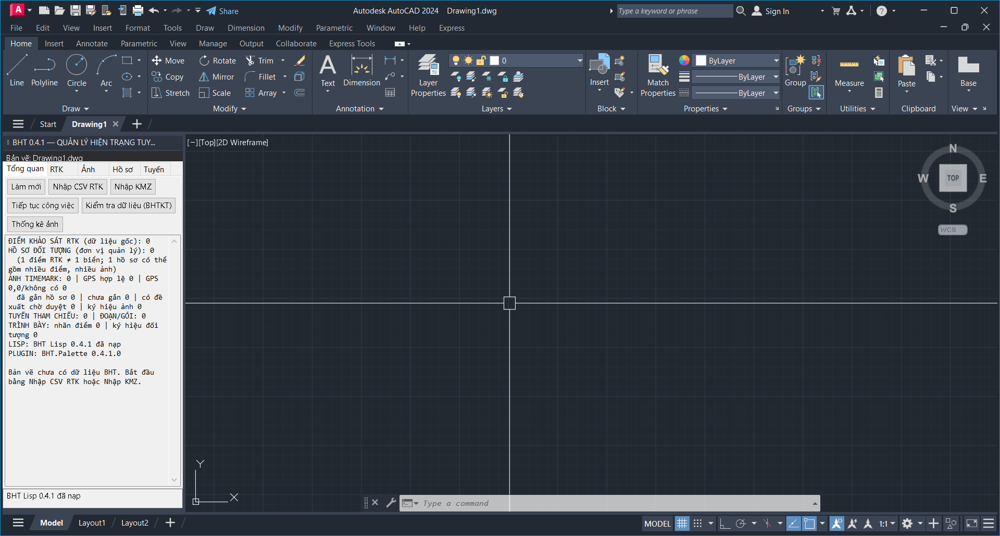

# Báo cáo kiểm thử BHT 0.4.1

Ngày kiểm thử: 2026-09-27. Môi trường: Windows, AutoCAD 2024, .NET Framework 4.8, `LISPSYS=1`.

## Kết quả

| Nhóm | Kết quả | Nội dung chính |
|---|---:|---|
| BHT.CoreTests | 56 PASS, 0 FAIL | mã hóa bản ghi, hồ sơ, ảnh, tìm kiếm, phiên bản, tương thích Lisp |
| Core Console S0/P | 15 PASS, 0 FAIL, 1 SKIP | nạp Lisp từ đường dẫn có dấu, API, tự kiểm tra, lệnh BTH trong môi trường không UI |
| Hồi quy A/B/L/R/L2/N/N2/NL/T | 144 PASS, 0 FAIL | dữ liệu mới, DWG 0.3.2/0.3.3, lưu/mở lại, C#↔Lisp, ảnh và lưới IRT |
| AutoCAD 2024 đầy đủ | PASS | bundle tự nạp Lisp + DLL, Palette gắn trái, Unicode đúng, năm thẻ hiện đủ, BTH/BHT chỉ mở một Palette |

Tổng kiểm thử tự động: **215 PASS, 0 FAIL, 1 SKIP**. Mục SKIP là `load_dialog` trong AutoCAD Core Console vì Core Console không có giao diện; nội dung DCL đã được kiểm bằng AutoCAD đầy đủ và tệp UTF-8 BOM.

## Phạm vi đã xác nhận

- `BHT-0.4.1.lsp` giữ hợp đồng dữ liệu `BHT_V02` và đọc được bản vẽ cũ.
- Assemblies có `FileVersion=0.4.1.0`; gói không chứa DLL Autodesk.
- Application Bundle nạp Lisp theo tài liệu và DLL theo lệnh; không cần NETLOAD thủ công.
- Palette hiển thị đúng tiếng Việt, có các thẻ **Tổng quan**, **RTK**, **Ảnh**, **Hồ sơ**, **Tuyến** ở chiều rộng gắn trái mặc định.
- Trạng thái trong Palette xác nhận `BHT Lisp 0.4.1 đã nạp` và `BHT.Palette 0.4.1.0`.
- Lệnh `BTH` và `BHT` dùng cùng một `PaletteHost`, gọi liên tiếp không tạo bảng thứ hai.

## Bằng chứng giao diện

Các thao tác cần tệp người dùng như chọn CSV/KMZ, chọn điểm bằng chuột và xem JPG đã được nối vào đúng luồng Palette; nên tiếp tục nghiệm thu bằng dữ liệu dự án thực tế trước khi dùng trên bản vẽ duy nhất.
